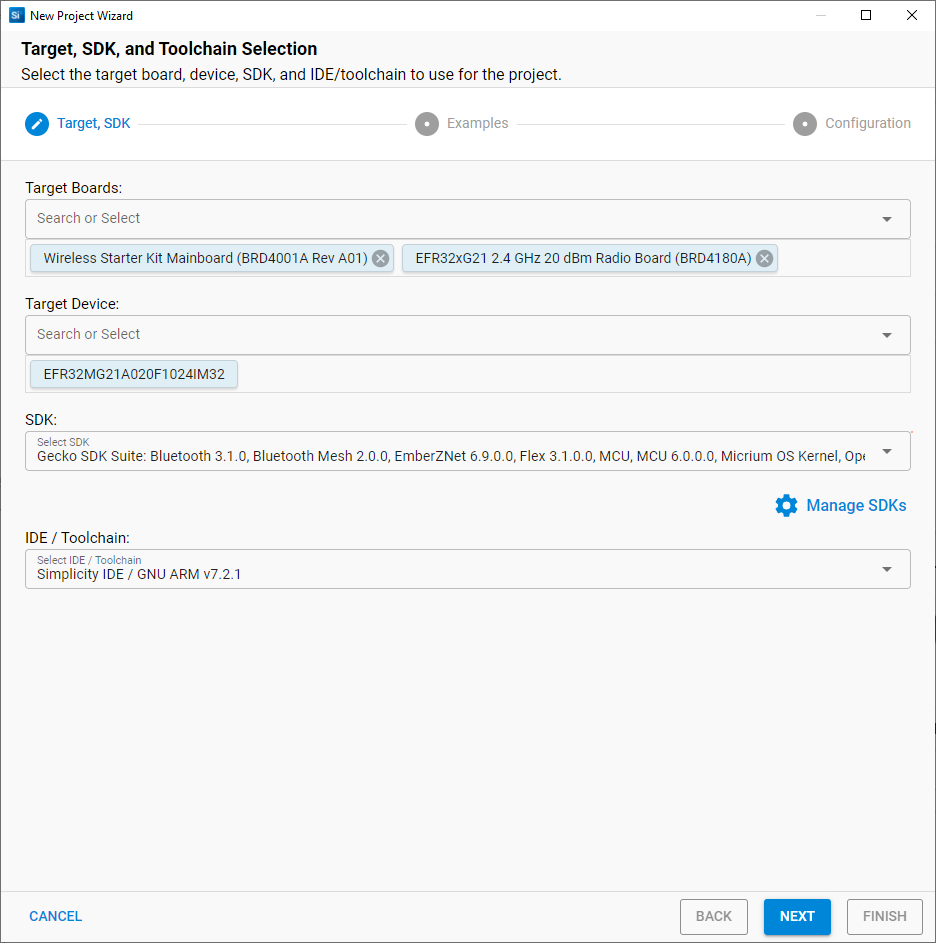
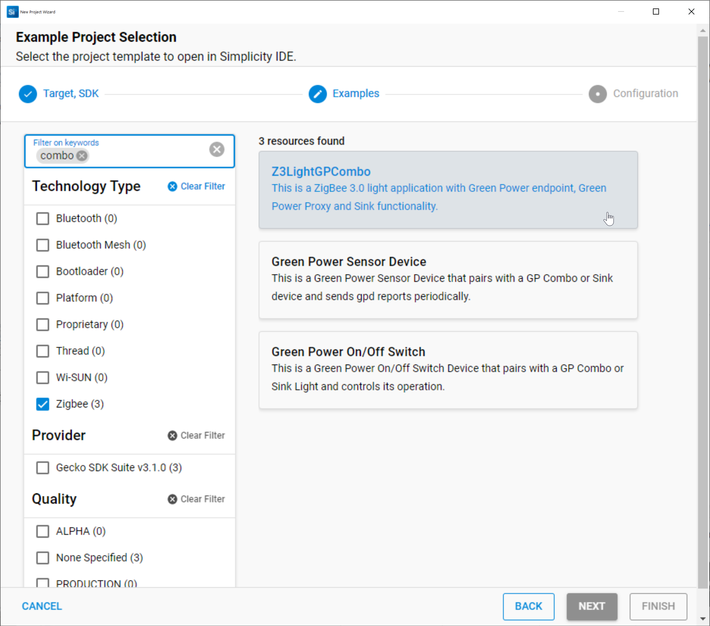
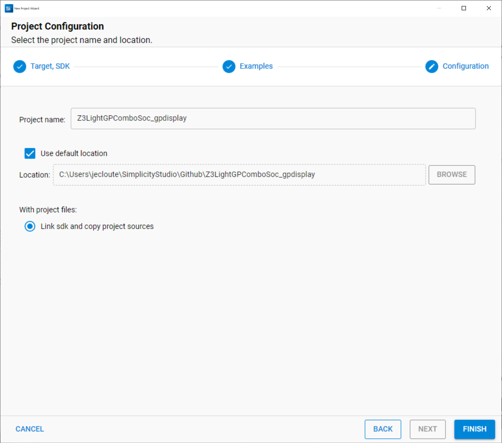
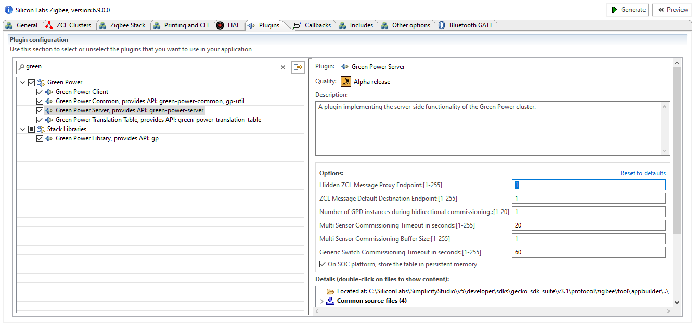
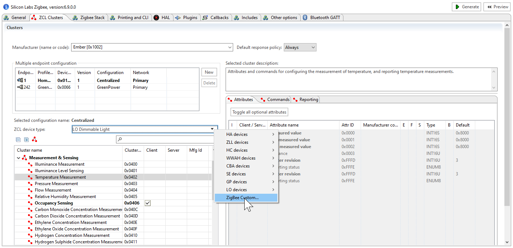
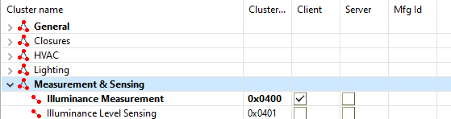
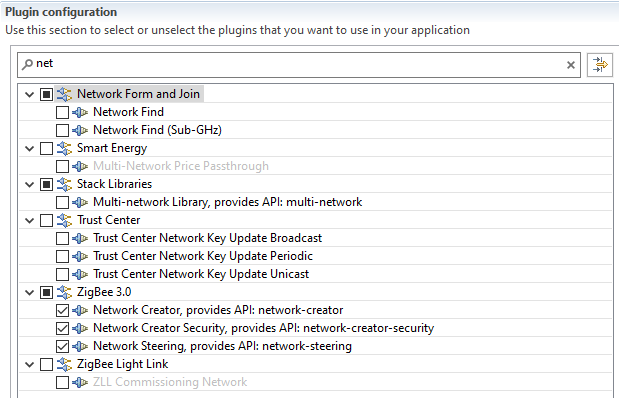
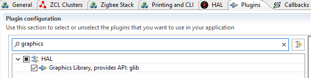
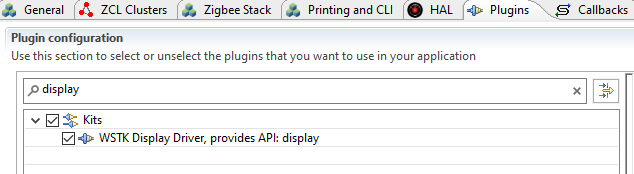

# Create and Configure the new project

- click on "create New Project" button and select the BRD4180A (EFR32MG21A) Hardware as your target.

-	Create a new Zigbee 3.0 project

-	Select "Z3_LightGPCombo" Sample Application and name it for example "Z3_LightGPCombo_gpdisplay"

-	In the ISC configuration, in the “Plugins” tab, select "green Power Sever" and change its "Hidden ZCL Message Proxy Endpoint" to 1 if it was otherwise. This is to solve a problem with the project generating with wrong endpoint. This should be solved in next version.

-	Because we want to be able to commission and get measurements for a light sensor, in the “Clusters” tab, we will need to modify the ZCL device type for endpoint 1. To do this select the endpoint, then select Zigbee Custom in the ZCL device type list.

then go to the Measurement & Sensing Clusters to add "Illuminance Measurement". Without this the application would not be able to commission the Green Power sensor and get its measurement values.

-	Because we created the custom ZCL device cluster in the previous step, we need to ensure all the Network Creator plugins are still in the project. Those are necessary to form the network if the router is not entering an existing network.

- Now, we would like to take advantage of the display available on the wireless kit, we will need to add in the "Plugins" tab:
  - graphics library (glib)
  - wstk display drivers

  

At this point we can click on Generate button to finish to create the project and focus on the code implementations.

 
