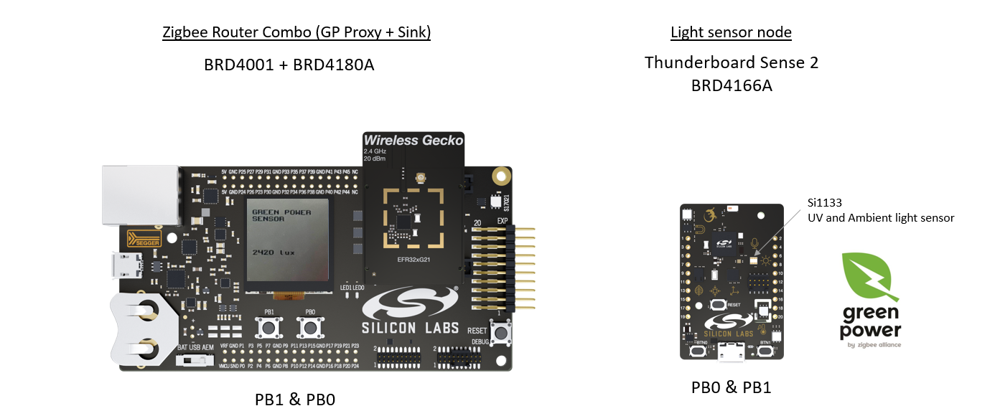

# Running the example

# 1- commission the Green Power node (Thunderboard Sense 2)

To follow the steps and exchanges in that demo, you can open a terminal for both boards. Settings are the usual 115200,8,N,1 et it is good to add local echo.
As you power up the 2 boards, the router will scan for existing open networks to join and if none will form one.
