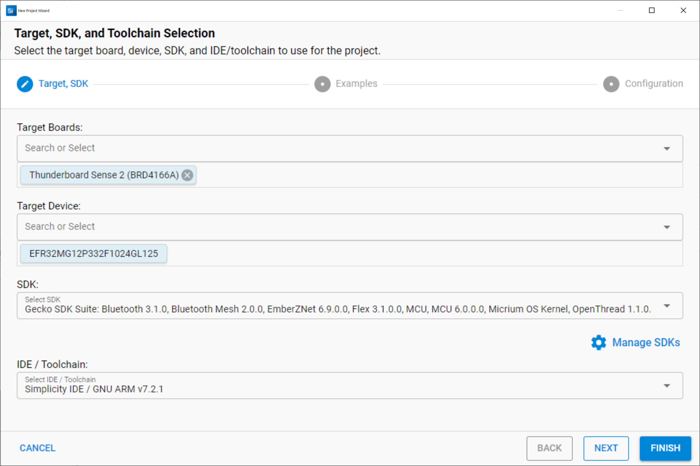
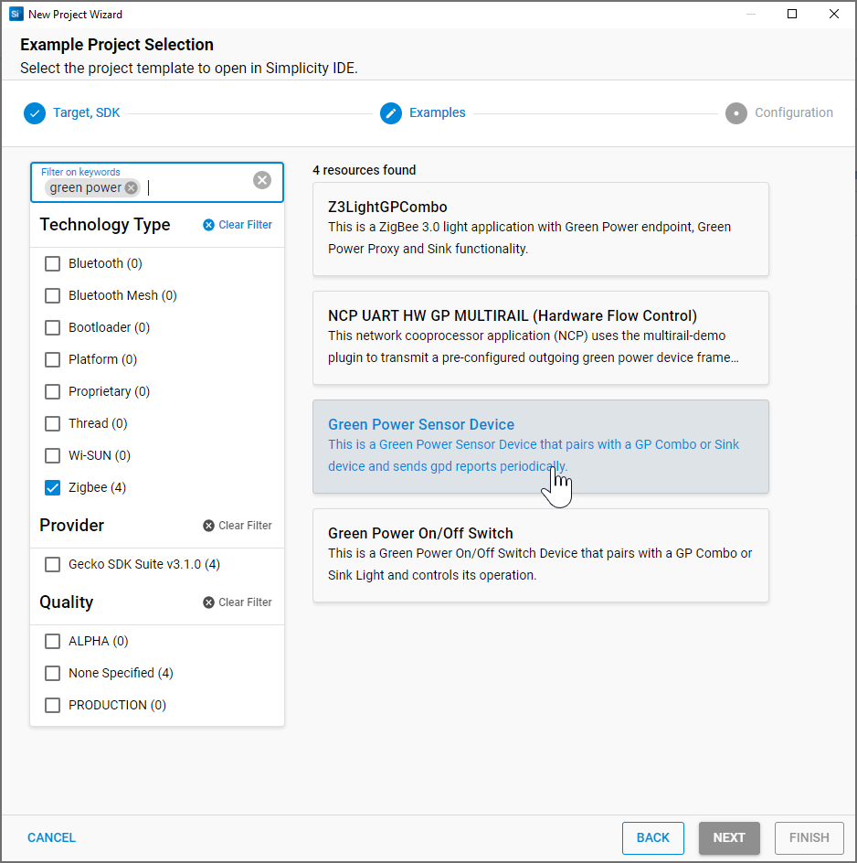
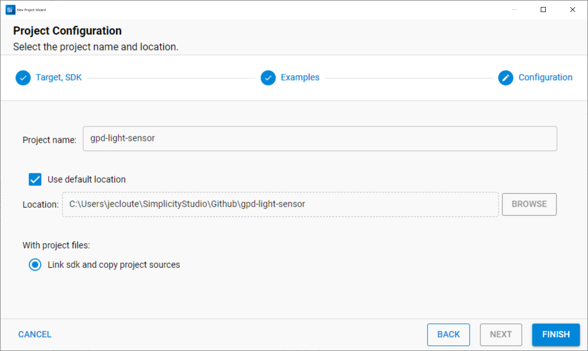
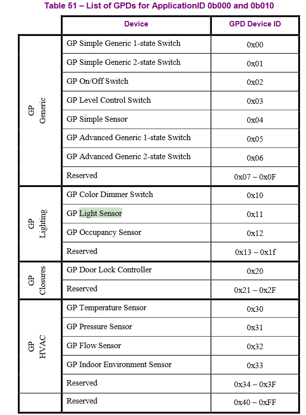
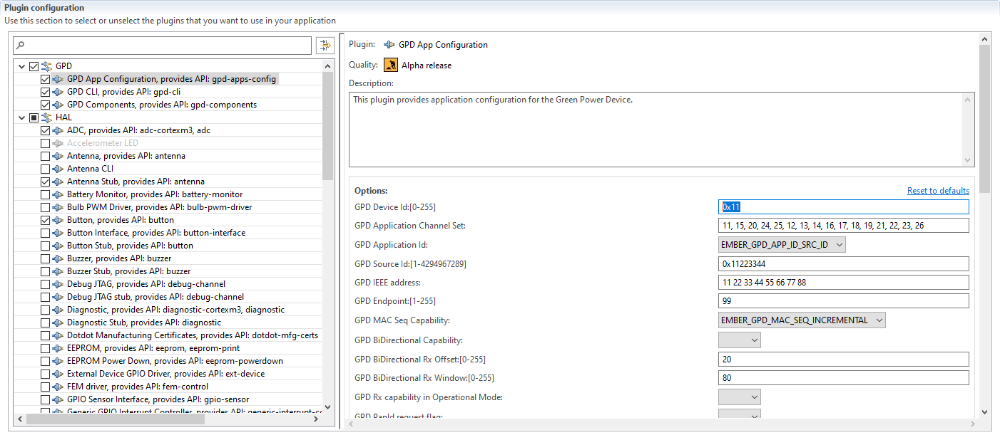

# Create and Configure the new project

- click on "create New Project" button and select the Thunderboard Sense 2 Hardware as your target.

-	Create a new Zigbee 3.0 project
-	Select "Green Power Sensor Device" Sample Application and name it for example "gpd-light-sensor"

-	In the ISC configuration, in the “Plugins” tab, change GPD Device Id in “GPD App Configuration” plugin to 0x11 which is corresponding to the GPD Light sensor we want to create.

At this point we can click on Generate button to finish to create the project

 
